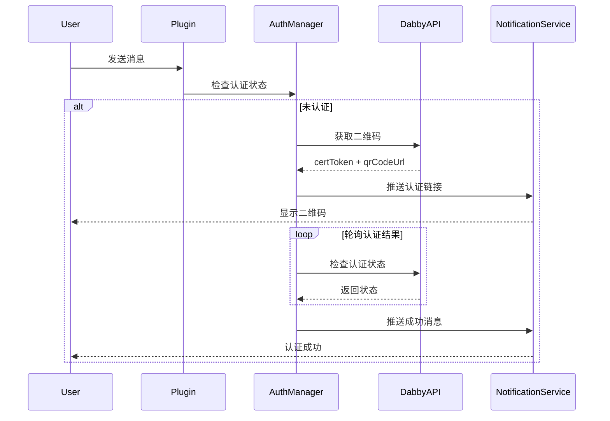

## 产品概述

创建一个新的 MFA 认证插件 Cclawd-mfa-auth，参考现有 mfa-auth 插件实现，修复现有问题并提供更稳定的认证体验。

## 核心功能

1. **首次对话认证**：用户首次对话时触发 MFA 认证流程，生成二维码认证链接，轮询认证结果接口，认证成功后推送通知消息给用户
2. **/reauth 命令**：用户可通过 /reauth 命令重置认证状态，重新发起认证流程
3. **敏感操作认证**：检测敏感操作（如 bash/exec 命令、敏感关键词），触发二次认证，轮询认证结果，成功后推送通知
4. **多渠道支持**：支持 Web/WebChat 端和其他主流消息渠道，通过统一的推送接口发送认证消息

## 技术栈

- TypeScript (ESM)
- OpenClaw Plugin SDK
- WebSocket (用于 Web 端消息推送)
- Node.js 内置模块 (crypto, fs, path)

## 实现方案

### 架构设计

采用分层架构，核心模块职责清晰：

```
Cclawd-mfa-auth/
├── index.ts                    # 插件入口，注册事件和命令
├── src/
│   ├── config.ts               # 配置管理（环境变量解析）
│   ├── types.ts                # 类型定义
│   ├── auth-manager.ts         # 认证会话管理（单例）
│   ├── dabby-client.ts         # Dabby API 客户端
│   ├── notification-service.ts # 统一消息推送服务
│   ├── polling-manager.ts      # 轮询管理器（优化后的轮询机制）
│   ├── session-resolver.ts     # 会话解析器（统一的 sessionKey 解析）
│   ├── sensitive-detector.ts   # 敏感操作检测器
│   └── providers/
│       ├── base.ts             # 认证提供者基类
│       └── qr-code.ts          # QR 码认证实现
```

### 核心改进点

1. **轮询机制优化**：使用独立的 PollingManager 管理轮询任务，支持取消、超时自动清理，避免内存泄漏
2. **统一会话解析**：SessionResolver 统一处理 sessionKey 解析逻辑，支持多渠道格式
3. **推送服务重构**：NotificationService 作为统一推送入口，支持渠道扩展
4. **错误处理增强**：完善的错误处理和日志记录

### 数据流



### 目录结构

```
extensions/cclawd-mfa-auth/
├── index.ts                      # [NEW] 插件入口，注册事件监听和命令
├── package.json                  # [NEW] 依赖配置
├── openclaw.plugin.json          # [NEW] 插件元数据
├── README.md                     # [NEW] 使用说明
├── src/
│   ├── config.ts                 # [NEW] 配置管理，环境变量解析
│   ├── types.ts                  # [NEW] 类型定义
│   ├── auth-manager.ts           # [NEW] 认证会话管理
│   ├── dabby-client.ts           # [NEW] Dabby API 客户端
│   ├── notification-service.ts   # [NEW] 统一消息推送服务
│   ├── polling-manager.ts        # [NEW] 轮询管理器
│   ├── session-resolver.ts       # [NEW] 会话解析器
│   ├── sensitive-detector.ts     # [NEW] 敏感操作检测器
│   └── providers/
│       ├── base.ts               # [NEW] 认证提供者基类
│       └── qr-code.ts            # [NEW] QR码认证实现
```

### 环境变量配置

```
MFA_AUTH_API_KEY=           # Dabby API Key
DABBY_API_BASE_URL=         # Dabby API 基础URL
MFA_VERIFICATION_DURATION=   # 敏感操作认证有效期(毫秒)，默认 120000
MFA_FIRST_MESSAGE_AUTH_DURATION= # 首次认证有效期(毫秒)，默认 86400000
MFA_REQUIRE_AUTH_ON_FIRST_MESSAGE= # 是否启用首次消息认证，默认 true
MFA_REQUIRE_AUTH_ON_SENSITIVE_OPERATION= # 是否启用敏感操作认证，默认 true
MFA_SENSITIVE_KEYWORDS=      # 敏感关键词，逗号分隔
MFA_GATEWAY_HOST=            # Gateway 主机地址，默认 127.0.0.1
MFA_ENABLE_AUTH_NOTIFICATION= # 是否启用认证成功通知，默认 true
MFA_AUTH_STATE_DIR=          # 认证状态持久化目录
```

## Agent Extensions

### SubAgent

- **code-explorer**
- Purpose: 探索现有插件实现细节，确保新插件与项目架构一致
- Expected outcome: 确认 OpenClaw Plugin SDK 的 API 接口和使用模式