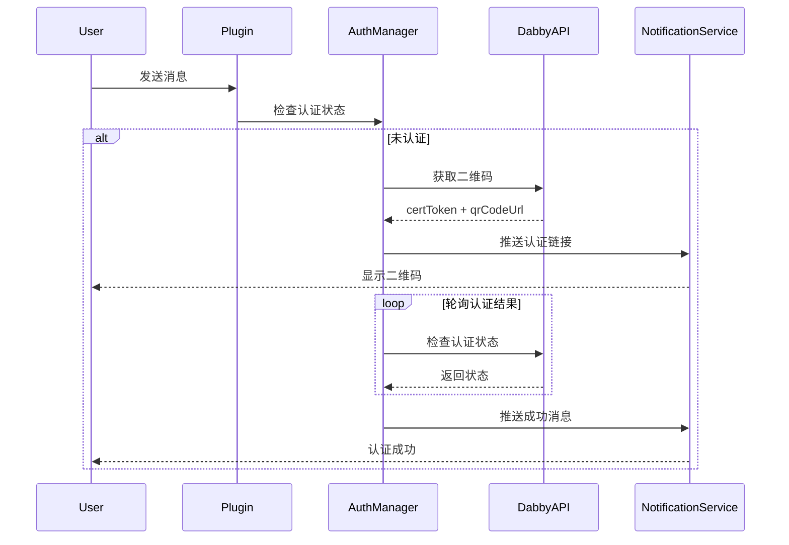

# Cclawd MFA Auth Plugin

OpenClaw 插件，为多渠道提供 MFA（多因素认证）功能。

## 功能特性

- ✅ **首次对话认证**：用户首次对话时触发 MFA 认证
- ✅ **敏感操作认证**：敏感操作（如执行命令）需要二次认证
- ✅ **/reauth 命令**：重置认证状态，重新认证
- ✅ **多渠道支持**：支持 Web/WebChat 和其他渠道
- ✅ **轮询认证结果**：自动轮询认证状态，成功后推送通知

## 安装

```bash
pnpm install
```

## 配置

通过环境变量配置插件：

```bash
# Dabby API 配置
MFA_AUTH_API_KEY=your_api_key_here
DABBY_API_BASE_URL=https://api.dabby.com

# 认证有效期（毫秒）
MFA_VERIFICATION_DURATION=120000              # 敏感操作认证有效期，默认 2 分钟
MFA_FIRST_MESSAGE_AUTH_DURATION=86400000      # 首次认证有效期，默认 24 小时

# 功能开关
MFA_REQUIRE_AUTH_ON_FIRST_MESSAGE=true        # 启用首次消息认证
MFA_REQUIRE_AUTH_ON_SENSITIVE_OPERATION=true  # 启用敏感操作认证

# 敏感关键词（逗号分隔）
MFA_SENSITIVE_KEYWORDS=rm,delete,drop,shutdown

# Gateway 配置
MFA_GATEWAY_HOST=127.0.0.1                    # Gateway 主机地址
MFA_ENABLE_AUTH_NOTIFICATION=true             # 启用认证成功通知

# 状态持久化目录
MFA_AUTH_STATE_DIR=~/.openclaw/cclawd-mfa-auth/
```

## 使用

### 1. 首次对话认证

用户首次发送消息时，插件会自动触发认证流程：

1. 生成二维码认证链接
2. 推送认证链接给用户
3. 轮询认证状态
4. 认证成功后推送通知

### 2. 敏感操作认证

当用户执行敏感操作（如 bash 命令包含敏感关键词）时：

1. 拦截操作
2. 要求二次认证
3. 认证成功后允许执行

### 3. /reauth 命令

用户可以随时发送 `/reauth` 命令重新认证：

```
/reauth
```

## 认证流程



## 支持的渠道

- ✅ Web/WebChat
- ✅ Feishu（飞书）
- 🚧 其他渠道（可扩展）

## 开发

```bash
# 开发模式
pnpm dev

# 构建
pnpm build
```

## License

MIT
