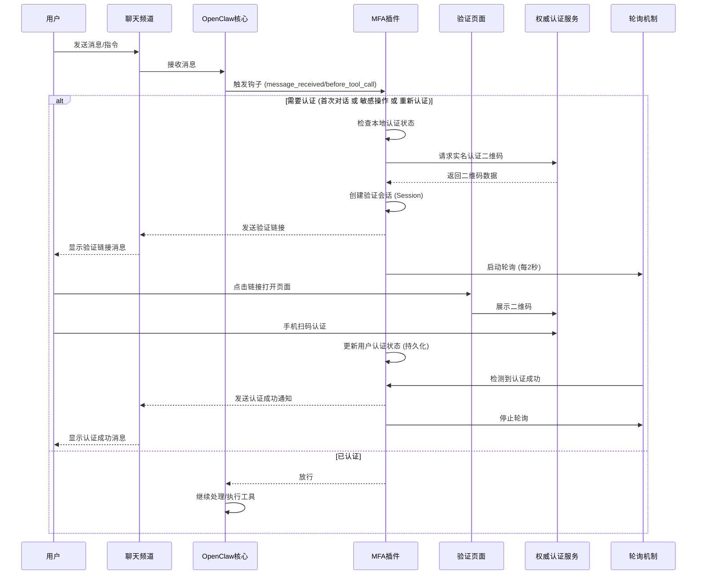

# MFA Auth 扩展

`mfa-auth` 是一个提供多因素身份验证（MFA）的安全扩展插件。它主要用于保护敏感操作和验证首次对话的用户身份,确保系统的安全性和可控性。

## 功能特性

1. **首次对话验证**：可配置新用户在首次发送消息时必须通过身份验证。
2. **二次认证,敏感操作拦截**：自动拦截包含敏感关键词（如 `rm`, `restart`, `sudo`, `delete` 等）的命令执行,要求用户进行二次验证。
3. **二维码验证**：集成 **权威认证服务**，提供便捷的扫码实名认证。
4. **状态持久化**：验证状态可配置有效期并持久化保存,避免频繁重复验证。
5. **多渠道支持**：支持 **飞书(Feishu)** 聊天渠道,为不同场景提供灵活的认证方式。

## 实现原理

### 核心架构

插件主要由以下几个部分组成：

- **AuthManager (`src/auth-manager.ts`)**: 核心管理器，负责维护用户的验证状态（敏感操作权限、首次对话权限）和管理验证会话（AuthSession）。
- **HTTP Server (`src/server.ts`)**: 启动一个本地 HTTP 服务（默认端口 `18801`），用于托管验证页面和处理前端轮询请求。
- **拦截钩子 (`index.ts`)**:
  - `before_tool_call`: 拦截工具调用，检查命令是否包含敏感词。
  - `message_received`: 拦截用户消息，检查是否为新用户首次对话。
- **验证提供者 (`src/providers/qr-code.ts`)**: 实现了基于权威认证服务的二维码验证逻辑。

### 工作流程



**关键机制说明**：

1. **聊天侧轮询**：插件在发送认证链接后，启动一个每 2 秒轮询一次的检测机制
2. **原子通知**：使用 `checkAndConsumeNotification` 确保认证成功消息只发送一次
3. **场景化消息**：根据不同场景（首次认证、重新认证、二次认证）发送不同的成功消息
4. **超时保护**：轮询会在 `config.timeout + 10秒` 后自动停止

## 通知机制

插件采用**聊天侧轮询**机制来检测认证成功状态，确保认证成功消息能够及时推送到聊天窗口。

### 工作原理

1. **启动轮询**：当插件拦截需要认证的操作时，会立即启动一个每 2 秒执行一次的轮询检测
2. **状态检查**：轮询过程中，插件会检查内存中的用户认证状态（`isUserVerifiedForFirstMessage` 或 `isUserVerifiedForSensitiveOps`）
3. **发送通知**：检测到认证成功后，立即发送相应的成功消息到聊天窗口
4. **停止轮询**：发送成功消息后，自动停止轮询

### 通知消息类型

| 场景 | 触发条件 | 消息内容 |
|------|----------|----------|
| 首次认证 | 用户首次通过认证 | `✅ 首次认证成功，请继续对话。` |
| 重新认证 | 用户通过 `/reauth` 命令重新认证 | `✅ 重新认证成功，请继续对话。` |
| 二次认证 | 用户通过敏感操作认证 | `✅ 二次认证成功，请重新发送之前的命令（或回复'确认'）即可执行。` |

### 防重复机制

- 使用 `checkAndConsumeNotification` 原子性地消费通知，确保同一认证成功消息只发送一次
- 如果用户在轮询检测到认证前手动发送了消息，通知会被自动取消，避免重复

### 超时保护

- 轮询会在 `config.timeout + 10秒` 后自动停止，避免无限轮询
- 如果认证会话过期或被清理，轮询也会提前停止

## 渠道支持

本插件目前支持以下聊天渠道:

| 渠道                                                               | 状态        | 说明                                |
| :----------------------------------------------------------------- | :---------- | :---------------------------------- |
| **飞书 (Feishu/Lark)**                                             | ✅ 完全支持 | 通过飞书 API 发送认证链接           |
| **Web/Webchat**                                                     | ⚠️ 暂不支持 | 待开发                              |
| 其他渠道 (Telegram, Discord, Slack, Signal, iMessage, WhatsApp 等) | ⚠️ 暂不支持 | 待开发                              |

**注意**:

- 对于不支持的渠道,插件会记录警告日志,但不会发送认证通知
- 飞书渠道需要正确配置飞书账号信息才能发送认证链接

## 安装指南

### 1. 安装依赖

在 `extensions/mfa-auth` 目录下运行：

```bash
npm install
```

### 2. 配置环境变量

插件依赖环境变量进行配置。你可以在运行 OpenClaw 时设置这些变量，或者将其添加到你的根目录**.openclaw/.env**环境配置文件中。

**示例 `.env` 配置**

你可以直接复制以下内容到你的 `.env` 文件中，并填入你的权威认证服务账号信息：

```ini
# --- MFA 认证扩展配置 ---

# 权威认证服务账号 (必填)
MFA_AUTH_API_KEY=your_api_key_here

# 敏感操作关键词 (自定义拦截列表)
# 只有当命令中包含这些关键词时，才会被拦截
MFA_SENSITIVE_KEYWORDS=delete,remove,rm,unlink,rmdir,format,wipe,erase,exec,eval,system,shell,bash,sudo,su,chmod,chown,restart,shutdown,reboot,gateway,kill,stop,drop,truncate

# 首次认证配置
MFA_REQUIRE_AUTH_ON_FIRST_MESSAGE=true      # 启用首次对话认证
MFA_FIRST_MESSAGE_AUTH_DURATION=86400000    # 首次认证有效期 (24小时)

# 二次认证配置
MFA_REQUIRE_AUTH_ON_SENSITIVE_OPERATION=true  # 启用敏感操作二次认证
MFA_VERIFICATION_DURATION=120000            # 敏感操作验证有效期 (2分钟)

# 存储路径
MFA_AUTH_STATE_DIR=~/.openclaw/mfa-auth/    # 认证状态持久化目录

```

**配置详解：**

- `MFA_AUTH_API_KEY`: 权威认证服务的 API Key。
- `MFA_AUTH_DOMAIN`: **重要！** 如果你的服务器部署在云端，用户无法直接访问内网 IP，请配置此项。
  - 示例：`http://auth.example.com` 或 `https://auth.example.com`
  - 如果包含协议头（http/https），插件将直接使用该 URL 前缀，不再附加端口号。
  - 如果不包含协议头，插件会自动附加 `http://` 和端口号（默认 18801）。

**可选配置：**

| 变量名                                    | 描述                                 | 默认值                                            |
| :---------------------------------------- | :----------------------------------- | :------------------------------------------------ |
| `MFA_SENSITIVE_KEYWORDS`                  | 触发拦截的敏感关键词列表（逗号分隔） | `rm, restart, sudo, format...` (详见 `config.ts`) |
| `MFA_REQUIRE_AUTH_ON_SENSITIVE_OPERATION` | 是否开启敏感操作二次认证             | `true`                                            |
| `MFA_VERIFICATION_DURATION`               | 敏感操作验证通过后的有效期（毫秒）   | `120000` (2分钟)                                  |
| `MFA_REQUIRE_AUTH_ON_FIRST_MESSAGE`       | 是否开启首次对话强制认证             | `false` (设为 `true` 开启)                        |
| `MFA_FIRST_MESSAGE_AUTH_DURATION`         | 首次对话认证的有效期（毫秒）         | `86400000` (24小时)                               |
| `MFA_AUTH_STATE_DIR`                      | 认证状态持久化存储目录               | `~/.openclaw/mfa-auth/`                           |

### 3. 启用插件 (openclaw.json)

你需要在 `openclaw.json` 配置文件中显式加载并启用该插件。

请编辑你的 `openclaw.json`，在 `plugins` 部分添加如下配置：

```json
{
  "plugins": {
    "enabled": true,
    "allow": ["mfa-auth"],
    "load": {
      "paths": [
        // 确保包含 extensions 目录的绝对路径
        "/path/to/your/openclaw/extensions/mfa-auth"
      ]
    },
    "entries": {
      // 启用 mfa-auth 插件
      "mfa-auth": {
        "enabled": true
      }
    }
  }
}
```

> **注意**：请根据你的实际环境修改 `paths` 中的路径。

## 使用示例

### 场景一：首次对话认证

**配置**：`MFA_REQUIRE_AUTH_ON_FIRST_MESSAGE=true`

**新用户**：`你好`

**OpenClaw (MFA 插件)**：

> 🔒 **身份验证请求**
>
> 为了保障安全，首次对话需要进行实名认证。请点击链接完成验证：
> http://localhost:18801/mfa-auth/session_12345
>
> 验证有效期: 5 分钟

**用户**：(点击链接 -> 扫码认证成功)
**OpenClaw (MFA 插件轮询检测到认证)**：

> ✅ 首次认证成功，请继续对话。

### 场景二：执行敏感命令

**用户**：`帮我delete一下我电脑桌面的test.txt文件` (假设 `delete` 在敏感词列表中)

**OpenClaw (MFA 插件)**：

> ⚠️ **🔐 该操作需要二次认证**
>
> 检测到敏感操作，请点击下方链接进行身份验证：
> http://localhost:18801/mfa-auth/session_67890
>
> 验证有效期: 5 分钟
>
> 验证成功后，请回复"确认"或者重新发送之前的命令以继续执行。

**用户**：(点击链接 -> 扫码认证成功)
**OpenClaw (MFA 插件轮询检测到认证)**：

> ✅ 二次认证成功，请重新发送之前的命令（或回复'确认'）即可执行。

### 场景三：主动重新认证

用户可以使用 `/reauth` 命令主动清除当前的认证状态并重新进行身份验证。这在用户怀疑账号安全或需要刷新认证有效期时非常有用。

**用户**：`/reauth`

**OpenClaw (MFA 插件)**：

> 🔐 **重新认证**
>
> 请点击以下链接完成身份验证:
> http://localhost:18801/mfa-auth/session_abcde
>
> _验证有效期: 5 分钟_

**用户**：(点击链接 -> 扫码认证成功)
**OpenClaw (MFA 插件轮询检测到认证)**：

> ✅ 重新认证成功，请继续对话。

## 推荐技能 (Skill)

为了让 OpenClaw 拥有更强的能力（如联网搜索、操作浏览器、长期记忆），建议安装以下核心技能。

### 1. 安装技能管理器 (ClawHub)

ClawHub 是 OpenClaw 的"应用商店"和包管理器，用于安装和管理各种技能。它是 AI 的**进化系统**。

```bash
npm i -g clawhub
```

### 2. 安装增强技能

| 技能名称                  | 类别          | 价值                                 | 安装命令                                |
| :------------------------ | :------------ | :----------------------------------- | :-------------------------------------- |
| **tavily-search**         | 感官系统 (眼) | 让 AI 能搜索实时信息，看到外面的世界 | `clawhub install tavily-search`         |
| **agent-browser**         | 执行系统 (手) | 让 AI 能操作浏览器，访问和交互网页   | `clawhub install agent-browser`         |
| **elite-longterm-memory** | 感官系统 (脑) | 给 AI 装上记忆，让它越用越懂你       | `clawhub install elite-longterm-memory` |

**批量安装命令：**

```bash
clawhub install tavily-search
clawhub install agent-browser
clawhub install elite-longterm-memory
```

---

## 相关文档

查看完整的[这3个 Skills 配置指南](../../use-skills-doc.md)
